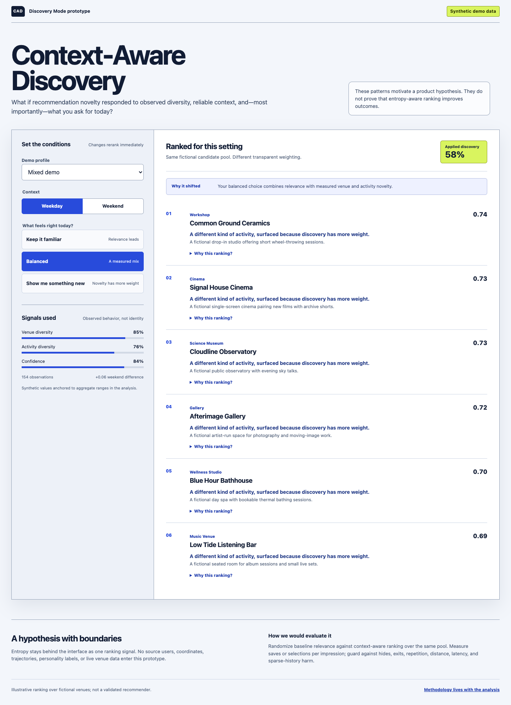
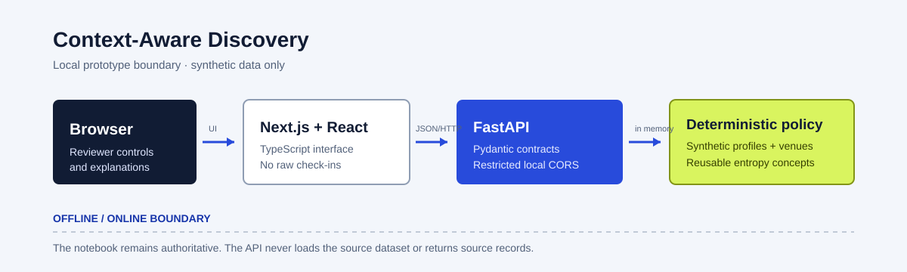

# Location Entropy Analysis + Context-Aware Discovery

**Author:** Jin Tao · **Email:** jintaoyap@gmail.com

This project studies whether people repeatedly check in at a small set of venues or spread visits more widely across the Foursquare TSMC 2014 NYC and Tokyo samples. The executed [`location_entropy_analysis.ipynb`](notebooks/location_entropy_analysis.ipynb) is the authoritative analysis.

A bounded full-stack companion prototype turns the findings into a testable product hypothesis: **Context-Aware Discovery**. Its **Discovery Mode** transparently reranks fictional places as a reviewer changes a synthetic profile, weekday/weekend context, and explicit discovery preference.

> **Claim boundary:** The observed patterns motivate product hypotheses. They do not show that high-entropy users prefer novel recommendations, that weekends cause exploration, or that entropy-aware ranking improves engagement. The prototype is an illustrative deterministic ranker—not a trained or validated recommender.



## Run locally

Requires Python 3.11+, [`uv`](https://docs.astral.sh/uv/), npm, and Node.js `^20.19.0 || >=22.12.0`.

### Analysis

```bash
uv sync --frozen
uv run pytest
uv run jupyter lab notebooks/location_entropy_analysis.ipynb
```

### Python API

```bash
uv sync --frozen
uv run uvicorn backend.api.main:app --reload
```

FastAPI runs at `http://localhost:8000`. Useful endpoints:

- `GET /health`
- `GET /profiles`
- `GET /venues`
- `POST /recommendations`
- Interactive schema: `http://localhost:8000/docs`

Development CORS allows only `http://localhost:3000` and `http://127.0.0.1:3000` by default. Override with a comma-separated `DISCOVERY_FRONTEND_ORIGINS` value.

### Next.js frontend

In a second terminal:

```bash
cd apps/frontend
npm install
npm run dev
```

Open **http://localhost:3000/prototype/discovery**. Copy `.env.example` to `.env.local` only if the API uses another base URL:

```bash
NEXT_PUBLIC_DISCOVERY_API_URL=http://localhost:8000
```

Control changes rerank immediately. Default state: **Mixed + Weekday + Balanced**.

## Tests and builds

```bash
# Analysis package + API
uv run pytest

# Frontend
cd apps/frontend
npm test
npm run typecheck
npm run build
```

## Prototype architecture



```text
Browser
  ↓
Next.js + React + TypeScript
  ↓ JSON/HTTP
FastAPI + Pydantic
  ↓
Deterministic ranking policy + synthetic demo fixtures
  ↓
Reusable entropy concepts from src/location_entropy
```

The API loads small safe fixtures at startup. It never loads the 800,000-row source dataset per request and never returns source records. The repository includes no database, authentication, maps, geocoding, external venue API, or trained model.

### Deterministic ranking policy

Explicit choices map to discovery levels `0.20`, `0.50`, and `0.80`. Explicit intent contributes 70% of applied discovery; confidence-adjusted observed diversity contributes 30%; a reliable weekend difference can add a modest weekend adjustment. Sparse profiles move the inferred signal toward neutral (`0.50`).

Candidates combine baseline relevance, venue novelty, profile-specific category novelty, and a distance penalty. For a category listed in the selected profile’s familiar history, category novelty is capped at `1 − profile.category_entropy`; other categories retain their fixture value. API responses expose the effective components and deterministic plain-language reasons. Candidate ID breaks ties.

The explain-first layout was retained after comparing three temporary structures: recommendation-first, explain-first, and side-by-side comparison. It made cause-and-effect clearest while preserving a practical single-column mobile flow. Losing variants are not part of the final application.

## Synthetic data and privacy boundary

The four demo profiles and fourteen venues in [`backend/api/fixtures`](backend/api/fixtures) are synthetic. Their values are anchored to aggregate ranges in the notebook, but they contain no source user IDs, venue IDs, coordinates, private-home categories, or trajectories. Fictional venue names and descriptions are for demonstration only. Source check-ins remain local and Git-ignored.

## Dataset

The assignment recommends the EPFL mobility dataset but allows another public spatio-temporal dataset. The recommended data were unavailable, so this analysis uses the **Foursquare TSMC 2014 NYC and Tokyo Check-in Dataset**.

Download it from the [dataset author’s Foursquare dataset page](https://sites.google.com/site/yangdingqi/home/foursquare-dataset), extract locally, and preserve the raw TSV files unchanged:

```text
dataset_tsmc2014/
  dataset_TSMC2014_NYC.txt
  dataset_TSMC2014_TKY.txt
  dataset_TSMC2014_readme.txt
```

`dataset_tsmc2014/` is ignored by Git. Do not convert the files to CSV or Parquet.

| File | Rows | SHA-256 |
|---|---:|---|
| `dataset_TSMC2014_NYC.txt` | 227,428 | `2f39ce698e5bff6683c74bec30c436cc022c160b0f3d73c5268b55491b2445f9` |
| `dataset_TSMC2014_TKY.txt` | 573,703 | `85542c605ce708d8584637756590383a84e9bbdb71342d0d8e78858ba2a0e5c8` |

The loader reads headerless TSV with Latin-1 encoding and explicit fields: `user_id`, `venue_id`, `category_id`, `category_name`, `latitude`, `longitude`, `timezone_offset_minutes`, and timezone-aware `utc_time`. It adds `city` and timezone-aware `local_time`. Users are keyed by `(city, user_id)` because IDs restart in each file.

## Project layout

```text
apps/frontend/                    # Next.js interaction prototype
backend/api/                     # FastAPI, ranking, Pydantic, fixtures
scripts/build_demo_profiles.py   # safe deterministic fixture boundary
src/location_entropy/            # reusable analysis package
notebooks/location_entropy_analysis.ipynb
tests/                            # analysis and API tests
docs/prototype-architecture.svg
```

## Metric API

```python
calculate_location_entropy(data, group_cols, location_col)
```

The vectorized function returns event count, unique-location count, base-2 entropy in bits, and normalized entropy for each group. It supports composite group keys and validates missing columns and null keys.

## Citation

Yang, D., Zhang, D., Zheng, V. W., & Yu, Z. (2015). Modeling User Activity Preference by Leveraging User Spatial Temporal Characteristics in LBSNs. *IEEE Transactions on Systems, Man, and Cybernetics: Systems*, 45(1), 129–142.
